# Welcome to Julia's profile!

- 誕生日 2005-10-22 
- 沖縄生まれ沖縄育ち 
- 高校3年生にWebエンジニアに興味を持ちはじめ、ITの専門学校を目指す 
---
### 現在
- 専門学校ITカレッジ沖縄 ITスペシャリスト科 情報工学科コース 在学(27卒予定) 
- ラウンドワンのアルバイトを約4年間継続中 

### 趣味
- youtube、X(旧Twitter)鑑賞 
- 特定の漫画、アニメを見ること 
- ショッピング
---
### 資格
- [SEA/J Certified Security Basic Master(令和 6年 8月22日)](https://www.sea-j.net/csbm) 
- [CompTIA IT Fundamentals(ITF+)(令和 6年 8月23日)](https://www.comptia.jp/certif/core/comptia_itf_new/) 
- [インターネット検定 ドットコムマスター ベーシック(令和 6年11月29日)](https://www.ntt.com/business/services/application/content-video-delivery/com-master.html) 
- [Linux技術者認定資格 LinuCレベル1 101試験(令和 7年 3月10日)](https://linuc.org/linuc1/) 
- [サーティファイ コミュニケーション検定 初級(令和 7年 8月19日)](https://www.sikaku.gr.jp/c/nc/) 
- [サーティファイ Javaプログラミング能力認定試験 3級(令和 7年 8月26日)](https://www.sikaku.gr.jp/js/cpjv/jv/introduction/) 
---

## ˚.🎀༘⋆ポートフォリオ˚.🎀༘⋆

ガイカレ祭の出席確認機能を搭載した、スタンプラリー形式クイズアプリ

※ ただの化け文字ではありません！最終ステージクリアへの鍵！

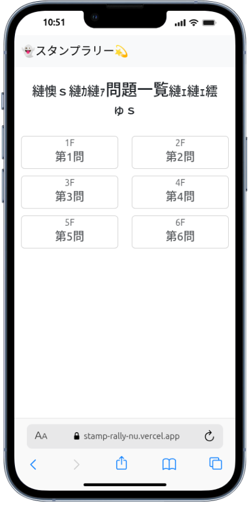
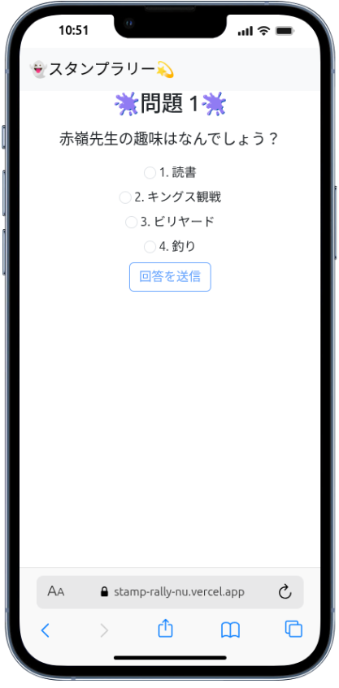

スタンプラリーログインから、1問目正解まで！ 
[動画はこちらから](https://drive.google.com/file/d/1rqTAZU8xHF9DV626VVmY08--n0dRfo14/view?usp=sharing)

スタンプラリーコンプリート！ 
[動画はこちらから](https://drive.google.com/file/d/1TlqIWjlAVa7hzq6exGbLvBuxDbLIiXj9/view?usp=sharing)

### 作成の様子
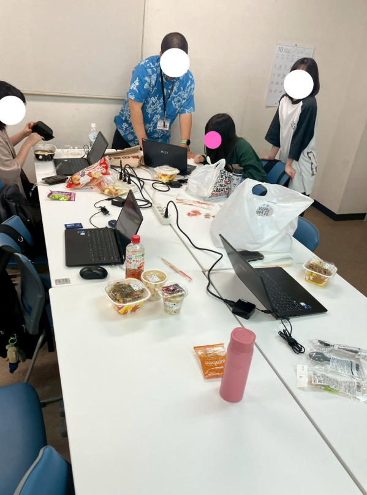
 
  <figcaption>スタンプラリー作成のリアルな様子...</figcaption>
 

### ガイカレ祭り当日
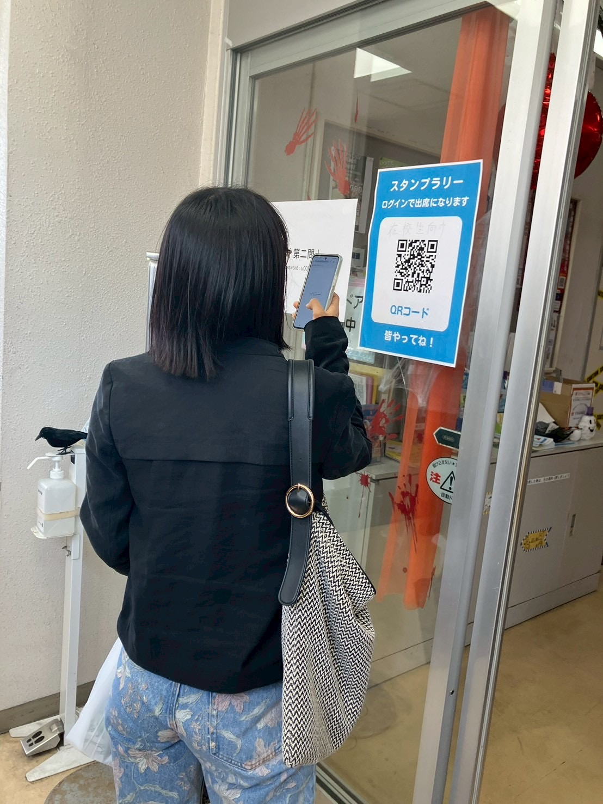

 
  <figcaption>スタンプラリー参加のためのQRコードを読み込んでいる様子。 いつの間にか沢山の方々が！</figcaption>

 

### 使用言語

- JavaScript 60.4%
- TypeScript 38.5%
- CSS 1.1%

Vercelはこちらから！ 
[https://stamp-rally-nu.vercel.app/](https://stamp-rally-nu.vercel.app/)

GitHubはこちらから！ 
[https://github.com/itc-s24025/StampRally](https://github.com/itc-s24025/StampRally)

 
 

オススメ店紹介

※ 授業内では著作権を考慮していませんので、モザイク処理を施しました！

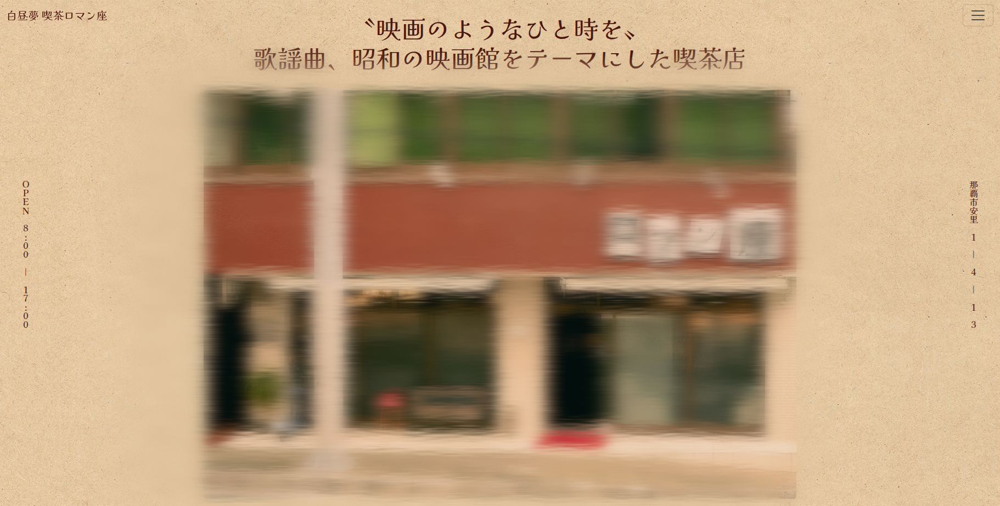
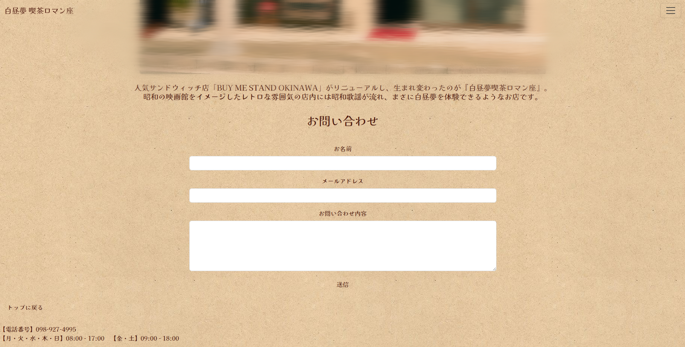
 
  <figcaption>HOME</figcaption>
 

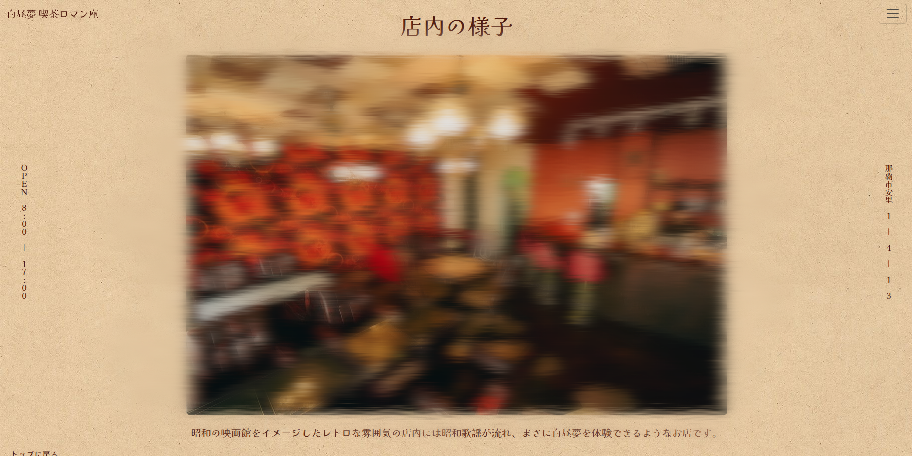
 
  <figcaption>店内の様子</figcaption>

 
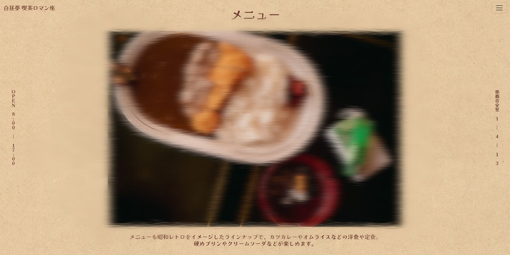
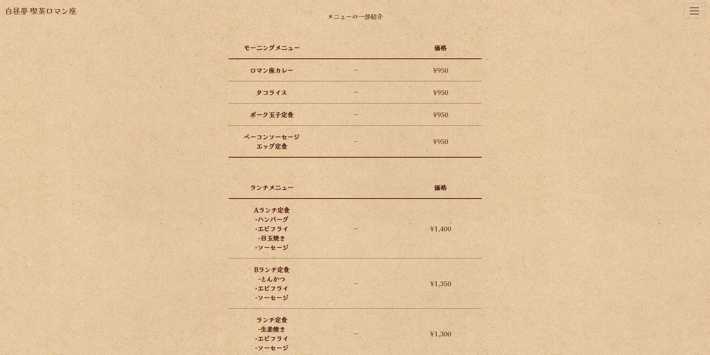
 
  <figcaption>メニュー</figcaption>

 

 
  <figcaption>交通アクセス</figcaption>

 
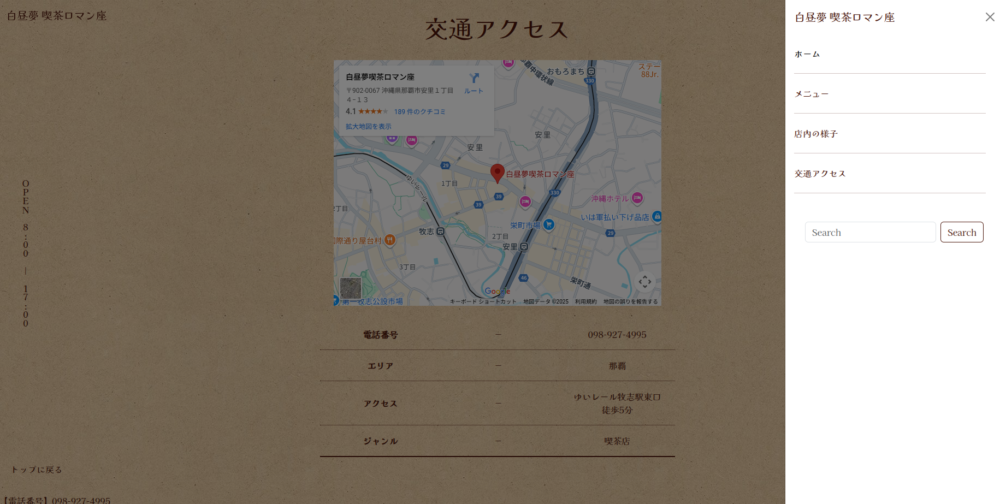
 
  <figcaption>ナビゲーションメニュー</figcaption>

### 使用言語

- HTML 90.4%
- CSS 9.6%

GitHubのリポジトリはこちらから！ 
[https://github.com/itc-s24025/WebEx_kouki](https://github.com/itc-s24025/WebEx_kouki)

 
 

お気に入りスポット紹介

外出にハマっているので、microCMSを使用して自分の好きな場所をまとめられるアプリを作りました！

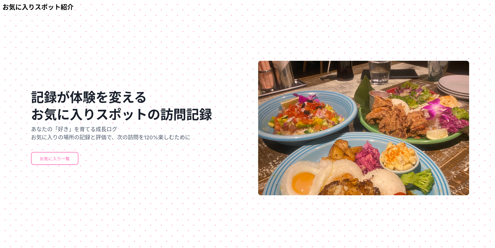
 
  <figcaption>HOME</figcaption>
 

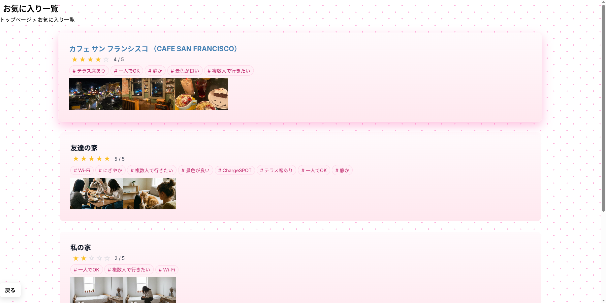
 
  <figcaption>お気に入り一覧</figcaption>
 

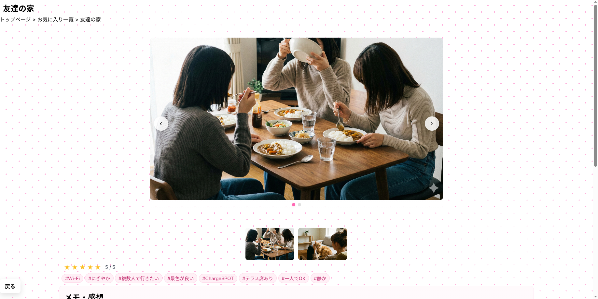
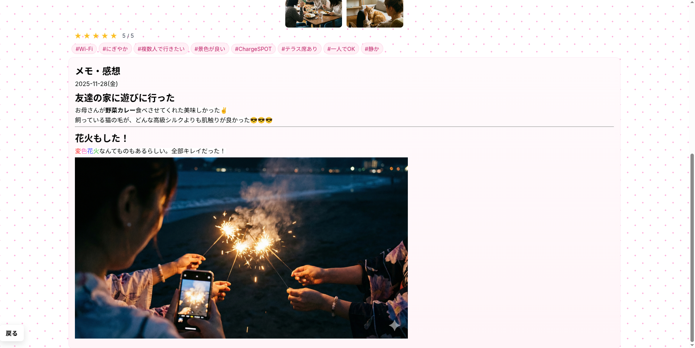
 
  <figcaption>お気に入りスポット詳細</figcaption>

### 使用言語

- TypeScript 51.3%
- CSS 48.4%
- JavaScript 0.3%

Vercelはこちらから！ 
[https://webfrontend-kadai-map-project.vercel.app/](https://webfrontend-kadai-map-project.vercel.app/)

GitHubのリポジトリはこちらから！ 
[https://github.com/itc-s24025/WebFrontEnd-kadai-map-project](https://github.com/itc-s24025/WebFrontEnd-kadai-map-project)

## 技術スタック
### 現在取り組んでいる言語
Python 
HTML/CSS 
JavaScript / TypeScript 
Java 等  

### OS
Linux (Ubuntu) 

### データベース
mariaDB 

### バージョン管理
GitHub 

### フレームワーク / ライブラリ
React 
Bootstrap 

### その他ツール/環境
Visual Studio Code 
IntelliJ IDEA 
Slack 
Node.js 等 

### 今後取り組みたいこと
GitHubの草を更に増やす 
チーム開発の経験を積む 
バックエンド開発への理解を深めるため、Python、PHP、Java、Node.js（JavaScript）の技術向上 

### 連絡先
s24025@std.it-college.ac.jp

<!--
## Hi there 👋
**itc-s24025/itc-s24025** is a ✨ _special_ ✨ repository because its `README.md` (this file) appears on your GitHub profile.

Here are some ideas to get you started:

- 🔭 I’m currently working on ...
- 🌱 I’m currently learning ...
- 👯 I’m looking to collaborate on ...
- 🤔 I’m looking for help with ...
- 💬 Ask me about ...
- 📫 How to reach me: ...
- 😄 Pronouns: ...
- ⚡ Fun fact: ...
-->
